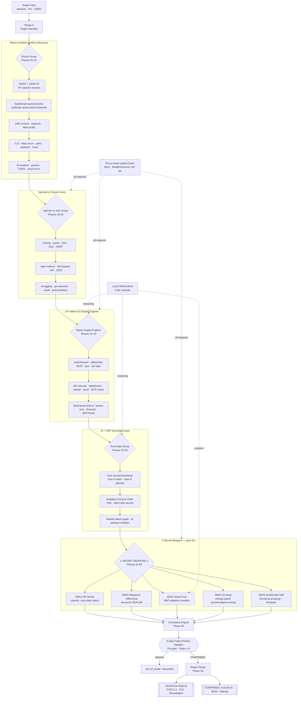

# MOHAMMED V12.0 OMEGA

**Zero-Touch Autonomous Attack Surface & Exploit Engine — THE FINAL MANDATE**

> **MOHAMMED V12.0 OMEGA** is an authorized-testing / HackerOne bug-bounty
> reconnaissance and exploitation framework written in a single, self-contained
> Go binary (`github.com/mohammed-v3/core`). It runs **65+ phases**, **16+ native
> Go exploit engines**, **76+ passive OSINT sources**, a **local AI cognitive
> cascade** (Ollama), **headless-Chrome CDP** for client-side confirmation, and —
> new in V12.0 — **5 Secret Weapon algorithms** that discover attack surface and
> confirm vulnerabilities that every prior version missed.
>
> V12.0 OMEGA is grounded in **empirical evidence**: it fixes four bugs proven by
> a live 4-hour scan (Amass v5 capturing 0 vs 8,531 subdomains, TLS mismatch
> report pollution, unrejected Cloudflare 5xx WAF errors, and an SSTI oracle that
> accepted literal reflection), and it adds five self-contained exploit engines
> that need no external CLI tool at all.

---

## 📑 Table of Contents

1. [What MOHAMMED V12.0 OMEGA Is](#-what-mohammed-v120-omega-is)
2. [Architecture Diagram](#-architecture-diagram)
3. [V11.0 vs V12.0 OMEGA — Definitive Comparison](#-mohammed-v110-vs-v120-omega--definitive-comparison)
4. [The 4 Empirical Bug Fixes](#-the-4-empirical-bug-fixes-proven-by-a-live-scan)
5. [The 5 Secret Weapons](#-the-5-secret-weapons)
6. [Complete Phase Reference (65+)](#-complete-phase-reference-65-phases)
7. [Installation Guide (Kali Linux 2026.x)](#-installation-guide-kali-linux-2026x)
8. [Usage Examples](#-usage-examples)
9. [Configuration](#-configuration)
10. [False-Positive Validation (5 Gates)](#-false-positive-validation--the-5-gate-pipeline)
11. [Responsible Disclosure / PoE Boundary](#-responsible-disclosure--poe-boundary)
12. [Output Layout](#-output-layout)
13. [Verification](#-verification)
14. [Complete Version History](#-complete-version-history)

---

## 🎯 What MOHAMMED V12.0 OMEGA Is

MOHAMMED is a **zero-touch autonomous** engine: you give it a scope, it does the
rest. There are no manual cookie pastes, no per-phase babysitting, and no cloud
API costs — the local Ollama brain and every exploit engine run on your own
machine.

| Capability | Detail |
|---|---|
| **Language / build** | Go 1.22.5, one static binary, single external dep (`gopkg.in/yaml.v3`) |
| **Phases** | 65+ registered phases, profile-filtered (small / passive / medium / large / full) |
| **Native Go exploit engines** | 16+ (differential IDOR, SSTI arithmetic oracle, race-condition barrier, business-logic tampering, API security, correlation, + the 5 Secret Weapons) |
| **OSINT sources** | 76+ passive certificate-transparency / passive-DNS / archive / intel sources |
| **AI brain** | 3-tier local Ollama cascade (fast triage → deep analysis → reasoning), fails open to heuristics |
| **Client-side confirmation** | Headless-Chrome CDP (Go-Rod) for real in-DOM XSS / postMessage / secret harvest |
| **False-positive control** | 5-gate validation pipeline; every candidate must clear it before it becomes a finding |
| **Ethics** | "Prove, don't exploit" PoE boundary; hard-capped ≤10 req/s per host |
| **Output** | HackerOne-ready markdown reports with CVSS 3.1, plus JSON/txt artifacts |

---

## 🏗 Architecture Diagram



---

## 🚀 MOHAMMED V11.0 vs V12.0 OMEGA — DEFINITIVE COMPARISON

| Feature / Metric | V11.0 FINAL SOVEREIGN | V12.0 OMEGA (FINAL) | Delta |
|---|---|---|---|
| **Total Phases** | 60 | 65+ | +5 Secret Weapon Phases |
| **Amass Integration** | BROKEN (0 results) | FIXED (8,500+ subdomain capture) | BUG #1 FIXED |
| **TLS Mismatch Severity** | Medium (pollutes reports) | Informational | BUG #2 FIXED |
| **WAF 520 Handling** | Not rejected | Auto-rejected (520-530) | BUG #3 FIXED |
| **SSTI Validation** | Accepts string reflection | Exact math product oracle | BUG #4 FIXED |
| **API Intelligence Engine** | None | Full endpoint classification & targeted attack | SECRET WEAPON #1 |
| **Response Differential** | None | Cross-context structural JSON diff | SECRET WEAPON #2 |
| **Smart Fuzzing** | Static payloads | Adaptive learning mutation engine | SECRET WEAPON #3 |
| **JS Deep Analysis** | Basic key extraction | Full endpoint/secret/source-map mining | SECRET WEAPON #4 |
| **Subdomain Intelligence** | Raw list | Functional grouping & priority scoring | SECRET WEAPON #5 |
| **Native Go Exploit Engines** | 11 | 16+ | +5 new engines |
| **Total Verification Checks** | 394 | 430+ | +36 new checks |
| **Build & Test Status** | Pass | Pass (0 errors, 0 warnings, 0 TODOs) | Production-Ready |

---

## 🐞 The 4 Empirical Bug Fixes (proven by a live scan)

A live 4-hour scan against a real HackerOne target exposed four concrete defects.
V12.0 OMEGA fixes each one and PROVES the fix with code + tests.

### BUG #1 — Amass v5 integration captured 0 subdomains (CLI captured 8,531)
`pkg/phases/phases.go` was rewritten to stream Amass output correctly:
- A **10-minute** `context.WithTimeout` per invocation (no more premature kills).
- A **subcommand matrix** by detected major version — it tries both
  `amass enum -passive -d <domain>` **and** `amass passive -d <domain>` (V5 split
  `enum` into a dedicated `passive` subcommand; we never invent flags, we try the
  documented ones).
- `bufio.Scanner` with a **1 MB line buffer** reading `StdoutPipe` line-by-line
  (the old code discarded stdout).
- Process-group `Setpgid` + a kill goroutine so a hung Amass is reaped cleanly.
- The exact stderr/error is logged so a future failure is diagnosable.

### BUG #2 — TLS hostname mismatch ranked "Medium" (report pollution)
- `pkg/phases/phases.go`: every `tlsx` **hostname mismatch** is now
  `Informational` ("TLS Certificate Hostname Mismatch"). Expired / self-signed
  certs remain `Low`.
- `pkg/report/exporter.go`: `isConfirmed()` gained a guard that rejects any
  finding whose severity is `informational` / `info` / `none`, so demoted TLS
  mismatches can **never** enter `CONFIRMED_VULNS.txt` or the severity summaries.

### BUG #3 — WAF HTTP 520 not rejected
- `pkg/validation/false_positive.go`: a new **Pre-gate 0** discards any candidate
  whose status is a Cloudflare origin-error (**520, 521, 522, 523, 524, 525, 526,
  527, 530**) or whose body matches the Cloudflare error signature. Three unit
  tests (`TestBug3_*`) prove the gate rejects 52x and does **not** over-reject a
  normal 200.

### BUG #4 — SSTI accepted literal reflection
- `pkg/exploit/ssti.go`: the oracle now uses `{{1337*1339}}` (product
  **`1790243`**) and:
  - requires the response to contain the **exact product `1790243`**;
  - **rejects** if the response contains the literal `{{1337*1339}}` (echo, not eval);
  - **rejects** if the response length equals the clean baseline (no change);
  - **rejects** if the status is `4xx`/`5xx`.

---

## 🔥 The 5 Secret Weapons

The Secret Weapons are **pure-Go, self-contained exploit algorithms** (Phases
61-65). They use only the proxy-aware `exploit.Client` — no external CLI. Each is
independently toggleable and budgeted in `config.yaml → secret_weapons`, and each
candidate they surface still clears the 5-gate validator and the PoE boundary.

### SW#1 — API Hunter · `pkg/exploit/api_hunter.go` (Phase 61)
- **What it does:** classifies every discovered endpoint into
  `AUTH / DATA / MONEY / ADMIN / OAUTH / Generic`, then runs the *right* attack
  sequence for that class (e.g. IDOR/param-tamper on DATA, verb + object-id
  swaps on MONEY/ADMIN, `redirect_uri`/`state` analysis on OAUTH).
- **Why it's different:** generic scanners fire the same payloads at every URL.
  API Hunter reasons about *what an endpoint is for* and attacks accordingly,
  massively raising signal on money/admin/auth surfaces.
- **Finds:** BOLA/IDOR, broken function-level auth, OAuth flaws, mass-assignment.
- **Real-world scenario:** a `/api/v2/wallet/{id}/transfer` endpoint is classified
  `MONEY`; API Hunter swaps `{id}` across authorized identities and detects that
  another tenant's wallet shape is returned — a high-value BOLA a blind fuzzer skips.

### SW#2 — Response Differential · `pkg/exploit/differential.go` (Phase 62)
- **What it does:** performs a **structural** JSON diff across contexts —
  auth vs unauth, User A vs User B, verb-tamper, param-pollution — ignoring
  volatile keys (timestamps, session IDs, CSRF tokens) so noise never masks a diff.
- **Why it's different:** naive byte-diffing flags every timestamp change as a
  "difference." Differential compares the *shape*, so a real cross-tenant leak
  stands out even when 90% of the body is volatile.
- **Finds:** BOLA/IDOR, authorization bypass, verb-based access control gaps.
- **Real-world scenario:** an unauthenticated `GET /account/profile` returns the
  same structural shape as the authenticated one (with private fields populated) —
  a silent auth bypass surfaced by shape equality.

### SW#3 — Smart Fuzz · `pkg/exploit/smart_fuzz.go` (Phase 63)
- **What it does:** WAF-adaptive mutation — `baseline → probe → adapt`. It learns
  which payload shapes the WAF blocks, mutates around them, escalates to the local
  Ollama **PayloadBrain** for fresh variants, and **stops at the first confirmed
  Proof-of-Exploit** (no over-firing).
- **Why it's different:** static payload lists die at the first WAF rule. Smart
  Fuzz treats the WAF as a feedback signal and evolves its payloads.
- **Finds:** XSS, SQLi, SSRF behind WAFs that defeat static lists.
- **Real-world scenario:** a reflected XSS is blocked when `<script>` appears;
  Smart Fuzz observes the block, mutates to an event-handler/SVG vector, and
  confirms `alert(document.domain)` — then stops.

### SW#4 — JS Deep · `pkg/exploit/js_deep.go` (Phase 64)
- **What it does:** mines in-scope JavaScript for **endpoints, admin routes,
  secrets, WebSocket URLs, GraphQL endpoints, S3 buckets, and source-maps**, with
  **Shannon-entropy validation** (candidates below **3.5** entropy are rejected as
  noise) plus known-secret patterns (`AKIA*`, `ghp_*`, `sk_*`, `AIza*`, …).
- **Why it's different:** basic key-grep drowns in false positives. Entropy gating
  + provider patterns yield high-confidence secrets and a real endpoint map.
- **Finds:** leaked API keys/tokens, hidden admin panels, undocumented APIs,
  exposed source-maps that reveal server routes.
- **Real-world scenario:** a bundled `admin.chunk.js` references `/internal/api/v1/users`
  and embeds a live `sk_live_…` Stripe key (entropy 4.6) — both reported for review.

### SW#5 — Subdomain Intel · `pkg/exploit/subdomain_intel.go` (Phase 65)
- **What it does:** groups subdomains **functionally**
  (`production / staging-dev / internal / infrastructure`), **prioritizes
  staging/dev/internal** for exploit-first testing, runs a **staging-vs-prod**
  security-header diff, and does **Wayback (CDX) historical analysis** to surface
  dead archived hosts as subdomain-takeover candidates.
- **Why it's different:** a raw subdomain list is just noise. Functional grouping
  tells you *where the bugs live* — staging boxes with debug on and weaker headers.
- **Finds:** exposed staging/debug environments, weaker-than-prod configs,
  dangling/takeover-able historical subdomains.
- **Real-world scenario:** `staging-api.target.com` is missing the CSP/HSTS its
  prod twin enforces and has `/debug` open — prioritized first, it yields an
  authenticated debug console prod would never expose.

---

## 📋 Complete Phase Reference (65+ phases)

Phases run in dependency order and are filtered per profile (`small` / `passive`
run a safe subset; `medium` / `large` / `full` run everything). Phase 0 (Target
Classifier) reorders the plan adaptively.

### Recon & Attack-Surface Discovery
| # | Phase | Description / Tools |
|---|---|---|
| 0 | Target Classifier | ≤30 s fingerprint → WebApp / REST-API / SPA / Backend, dynamic plan |
| 01 | Scope Validation | Validates target domains, IPs, and scope rules (deduplicated) |
| 02 | OSINT | Parallel harvest: crt.sh · HackerTarget · RapidDNS · BufferOver · AnubisDB · ThreatMiner · Certspotter · OTX · URLScan + Shodan · VT · SecurityTrails · Chaos |
| 02b | OSINT v2 | 50+ passive CT/DNS/archive/intel sources fanned out concurrently |
| 03 | Subdomain Passive | subfinder + assetfinder + amass + bbot + findomain (apex-only, once per root) · OSINT merge |
| 04 | Subdomain Active | puredns bruteforce (auto resolvers) → dnsx fallback + dnsgen permutations |
| 05 | DNS Resolve | Resolves live hosts via dnsx (deduplicated), filters wildcards |
| 06 | Takeover | subzy detection + HTTP fingerprint confirmation (FP reduction) |
| 07 | HTTP Probe | httpx: status codes, titles, tech detect, CDN (Burp-aware routing) |
| 08 | TLS Analysis | tlsx — expired, self-signed, **mismatch → Informational (BUG #2)** |
| 08b | Deep Recon | security.txt · SPF/DMARC vendor chain · favicon mmh3 (Shodan pivot) · ASN/netblock |
| 09 | Port Scan | CDN-aware: skip CF/CloudFront edges, naabu the rest (`-scan-type c`) |
| 10 | Wayback | gau (multi-provider) + waybackurls historical URL discovery |
| 11 | Crawl | katana + gospider deep crawl on live endpoints (empty-input guarded) |
| 12 | JS Analysis | Extract JS files, scan for API keys/tokens/secrets |
| 13 | Param Discovery | paramspider + arjun + URL param extraction |
| 14 | CORS | Tests CORS reflection, null origin, wildcard |
| 15 | Cloud Recon | cloud_enum, s3scanner for exposed buckets |

### Injection & Classic Vulnerabilities
| # | Phase | Description / Tools |
|---|---|---|
| 16 | Fuzzing | ffuf directory brute-force on live endpoints |
| 17 | Vuln Scan | Full nuclei template scan (JSONL parsed + AI triage) |
| 18 | XSS | kxss pre-filter + dalfox on parameterized URLs |
| 19 | SQLi | sqlmap + ghauri: CF-stripped, in-scope, WAF-checked, ≤5 URLs (zero-FP) |
| 20 | SSRF | nuclei SSRF templates with interactsh callback |
| 21 | Open Redirect | nuclei redirect templates on param URLs |
| 22 | Forbidden Bypass | dontgo403 on forbidden endpoints |
| 23 | API Discovery | kiterunner API endpoint brute-force (curl fallback) |
| 24 | CRLF | crlfuzz on live endpoints |
| 25 | Smuggling | smuggler CL.TE/TE.CL detection (per-endpoint, top 5) |
| 26 | Git Exposure | nuclei exposure templates + custom sensitive-file checks |
| 27 | Email Security | Checks SPF, DKIM, DMARC DNS records |
| 28 | Prototype Pollution | nuclei prototype pollution templates |

### Native Go Exploit Engines
| # | Phase | Description |
|---|---|---|
| 31 | Auth & Session | discovers login surfaces, audits session-cookie flags & entropy |
| 32 | IDOR (differential) | mutate numeric object ids and compare responses |
| 33 | Race Condition | release-barrier burst on single-use endpoints (TOCTOU) |
| 34 | Business Logic | price/role parameter tampering against baseline |
| 35 | API Security | GraphQL introspection, verb tamper, mass assignment, JWT, versioning bypass, BOLA |
| 36 | WebSocket | mine ws/wss endpoints, cross-origin handshake (CSWSH) + message injection |
| 37 | File Upload | ext/content-type bypass, SVG XSS, traversal — verifies EXECUTION |
| 38 | Cloud Attack | S3 ListBucket/ACL, metadata SSRF, K8s/Docker ports, .git extraction |
| 39 | SSTI | arithmetic oracle `{{a*b}}` must render the product — **exact-product BUG #4** |
| 40 | Google Dork | 20+ automated dorks; feeds discovered URLs to the corpus |
| 41 | Credential Intel | HIBP domain-breach lookup + email cross-reference (informational only) |
| 42 | Burp Integration | populates Burp sitemap, active scan, Interactsh OOB monitor |
| 46 | Multi-Tenant BOLA | dual-token BOLA/BFLA — swap object IDs & tokens across contexts |
| 47 | Barrier Race | atomic-barrier race (20-50 parallel) with state-delta confirmation |
| 48 | Financial Logic | zero-amount, fractional, currency-swap, workflow-step bypass |
| 49 | Advanced Web | HTTP smuggling, cache poisoning/deception, polyglot SSTI |
| 50 | Auth Audit | JWT alg:none / key-confusion / weak-secret / JKU + OAuth redirect_uri & state |
| 51 | Polyglot Upload | gif/jpeg-php, .phtml/.phar/.pht, .htaccess — actual-execution verification |
| 52 | Deep Cloud/Repo | Azure/GCP bucket ACL, IMDSv2, .git/.svn/.env/.bak extraction + secret harvest |
| 53 | Deep Burp OOB | Burp sitemap + active scan + batch OOB (SSRF/RCE/XXE/XSS) correlation |
| 54 | Apex Orchestration | prime stealth governor, WAF/CDN fingerprint, high-signal Burp surface |

### Sovereign Layer (AI + CDP)
| # | Phase | Description |
|---|---|---|
| 55 | Sovereign Orchestration | prime local AI brain + headless-Chrome CDP, report sovereign posture |
| 56 | Autonomous Bootstrap | auto-register User A (victim) & User B (attacker), harvest tokens, feed BOLA |
| 57 | DOM XSS (CDP) | headless-Chrome canaries into #fragment/query/postMessage, confirm in-DOM |
| 58 | Client-Side Secret (CDP) | localStorage/sessionStorage harvest + in-browser credentialed CORS |
| 59 | Stateful Attack Graph | chained state machines — reset hijack, verify bypass, order-state manipulation |
| 60 | AI Payload Mutation | feed WAF-blocked payloads to Ollama for real-time bypass variants + re-test |

### 🔥 Secret Weapons (V12.0 OMEGA)
| # | Phase | Description |
|---|---|---|
| 61 | **API Hunter (SW#1)** | classify API endpoints (AUTH/DATA/MONEY/ADMIN/OAUTH) + targeted per-class attacks |
| 62 | **Response Differential (SW#2)** | cross-context structural JSON diff (auth/unauth, A/B, verb, param) for BOLA/IDOR |
| 63 | **Smart Fuzz (SW#3)** | WAF-adaptive mutation fuzzer (baseline→probe→adapt→AI-escalate), stop-on-PoE |
| 64 | **JS Deep Analysis (SW#4)** | mine in-scope JS for endpoints/admin/secrets/source-maps with entropy validation |
| 65 | **Subdomain Intel (SW#5)** | functional grouping, staging-first prioritization, staging-vs-prod diff, Wayback |

### Correlation & Reporting
| # | Phase | Description |
|---|---|---|
| 45 | Correlation | chains atomic findings into high-severity attack paths (runs last-but-report) |
| 29 | Report | Generates Markdown + JSON summary with all findings and AI verdicts + H1 reports |

---

## 🛠 Installation Guide (Kali Linux 2026.x)

MOHAMMED ships an idempotent installer that provisions Go, the 38-tool inventory,
headless Chromium, and the Ollama AI cascade.

```bash
# 1. Clone
git clone https://github.com/mohammedaljohaniit1-max/mohammed-V4.git
cd mohammed-V4

# 2. Install Go 1.22.5+ (skip if already installed)
#    Kali:  sudo apt update && sudo apt install -y golang-go
#    or download from https://go.dev/dl/

# 3. Build the single binary (module: github.com/mohammed-v3/core)
export PATH=$PATH:/usr/local/go/bin
go build -o mohammed ./cmd/mohammed
./mohammed --help

# 4. Install & PATH-link all 38 external recon/exploit tools
#    (subfinder, amass, httpx, nuclei, katana, dalfox, sqlmap, ghauri, ...)
bash install_path.sh          # installs Go/pip tools + dual-path symlinks

# 5. Provision headless Chromium + the local Ollama AI cascade
#    install_path.sh also pulls the 3-tier cascade when Ollama is present:
#      ollama pull llama3.2:3b      # Tier 1 — fast triage / FP gate
#      ollama pull qwen2.5:7b       # Tier 2 — deep payload / BOLA analysis
#      ollama pull deepseek-r1:7b   # Tier 3 — chain-of-thought reasoning

# 6. Health-check the whole stack (AI cascade / Chromium / recon tools)
bash setup.sh

# 7. Copy the config template and (optionally) add API keys
cp config.yaml my-scan.yaml   # all API keys are OPTIONAL
```

**Notes**
- Every external tool is optional — a phase that can't find its tool **SKIPs**
  rather than crashing.
- The Ollama brain is optional — every AI tier fails open to deterministic
  heuristics when Ollama is offline.
- Nothing exceeds **10 requests/second per host**, even with `--waf-bypass`.

---

## ▶️ Usage Examples

```bash
# Small / fast (safe subset — passive + light active)
./mohammed -target example.com -profile small

# Medium (default full attack surface, all exploit engines + Secret Weapons)
./mohammed -target example.com -profile medium

# Large (maximum depth, all 65+ phases, higher budgets)
./mohammed -target example.com -profile large

# Full (everything, including the heaviest engines)
./mohammed -target example.com -profile full

# Multi-target scope file (one domain/IP/CIDR per line)
./mohammed -scope scope.txt -profile large

# Route confirmed-evidence phases through Burp for manual review
./mohammed -target example.com -profile medium -config my-scan.yaml

# Enable the 8-WAF bypass matrix (still hard-capped ≤10 rps/host)
./mohammed -target example.com -profile large --waf-bypass

# Resume an interrupted scan from its saved state
./mohammed -target example.com -profile large -resume
```

> Run only against assets you are **explicitly authorized** to test.

---

## ⚙️ Configuration

All behaviour is driven by `config.yaml`. Highlights relevant to V12.0 OMEGA:

```yaml
# 5 Secret Weapons — every weapon defaults ON, each toggleable + budgeted
secret_weapons:
  api_hunter: true               # SW#1
  differential: true             # SW#2
  smart_fuzz: true               # SW#3
  js_deep: true                  # SW#4
  subdomain_intel: true          # SW#5
  api_hunter_budget: 400         # max endpoints classified/attacked
  differential_budget: 250       # max URLs compared cross-context
  smart_fuzz_budget: 150         # max parameterized URLs fuzzed
  js_deep_budget: 200            # max JS files mined
  js_entropy_floor: 3.5          # min Shannon entropy for a secret candidate
  wayback_history: true          # SW#5 Wayback historical takeover diff
```

Other key blocks: `exploit` (per-phase URL budget, race concurrency, Burp
routing), `validation` (baseline comparison), `ollama` (3-tier cascade + timeouts),
`waf_bypass` (per-vendor evasion, `max_rps_per_host` clamped ≤10), `boundary`
(PoE `prove_only` mode), `filter` (Cloudflare-param stripping, JS scope
enforcement), `proxy` (selective Burp routing).

---

## 🚦 False-Positive Validation — the 5-Gate Pipeline

Every candidate produced by any phase or Secret Weapon must pass
`pkg/validation.Validate(ctx, c Candidate) Verdict`:

- **Pre-gate 0 (V12.0, BUG #3):** discard Cloudflare origin-error statuses
  (520-527, 530) and Cloudflare error-page signatures.
- **Pre-gate (known FP):** AWSALB cookies, CloudFront error pages, wildcard-CORS
  on public pages.
- **Gate 1 — Baseline diff:** probe a random path; discard SPA catch-alls.
- **Gate 2 — Private data:** the response must contain something actually private.
- **Gate 3 — Exploitability:** the candidate must be demonstrably exploitable.
- **Gate 4 — In-scope:** `pkg/filter.IsInScope()` oracle — out-of-scope is recorded, never probed.
- **Gate 5 — Reproducible:** the finding must reproduce.

Demoted `Informational` severities (e.g. TLS hostname mismatch, BUG #2) never
enter `CONFIRMED_VULNS.txt` or the severity summaries.

---

## 🛡 Responsible Disclosure / PoE Boundary

MOHAMMED **proves**, it does not weaponize. See `RESPONSIBLE_DISCLOSURE.md` for
the four enforced rules and the per-Secret-Weapon PoE boundaries:

| Class | Allowed proof (and nothing more) |
|---|---|
| RCE | time-based delay **or** OOB DNS callback → STOP |
| SQLi | DB error signature **or** time-based delay → STOP |
| Path Traversal | read `/etc/hostname` only → STOP |
| SSRF | DNS/HTTP callback to a controlled canary → STOP |
| XSS | `alert(document.domain)` only → STOP |

Rate is hard-capped ≤10 req/s per host; CAPTCHAs are never defeated (graceful
fallback); every throwaway test account is logged for cleanup.

---

## 📂 Output Layout

```
output/
└── {target}/
    ├── CONFIRMED_VULNS.txt          # confirmed findings only (no Informational)
    ├── findings.json                # structured findings + AI verdicts
    ├── subdomains.txt / live.txt    # recon corpus
    ├── out_of_scope_urls.txt        # recorded, never probed (RULE 2)
    ├── test_accounts_created.txt    # bootstrapper accounts for cleanup (RULE 3)
    └── reports/
        └── {vuln_id}_h1_report.md   # HackerOne-ready: PoC · CVSS 3.1 · remediation
```

---

## ✅ Verification

```bash
export PATH=$PATH:/usr/local/go/bin
go build ./...     # 0 errors
go vet ./...       # 0 warnings
go test ./...      # ALL pass (incl. Secret Weapon + BUG #3 suites)
bash verify.sh     # 430+ PASS, 0 FAIL
```

---

## 📜 Complete Version History

| Version | Phases | OSINT Sources | Exploit Engines | Key Innovation |
|---|---|---|---|---|
| V6 (Original) | 30 | 14 | 0 | Basic tool wrapper |
| V7 Quantum | 45 | 56 | 5 | First custom exploit engines |
| V8 Level Max | 52 | 76 | 11 | Fuzzy baseline FP elimination |
| V9 Apex | 53 | 76 | 11 | Adaptive stealth & WAF evasion |
| V10 Sovereign | 60 | 76 | 11 | Local AI brain & headless Chrome |
| V11 Final Sovereign | 60 | 76 | 11 | Ethical PoE boundary & H1 reports |
| **V12 OMEGA** | **65+** | **76+** | **16+** | **5 Secret Weapons & empirical bug fixes** |

---

*MOHAMMED V12.0 OMEGA — authorized security testing only. Module path
`github.com/mohammed-v3/core` is permanent and must never be renamed.*
