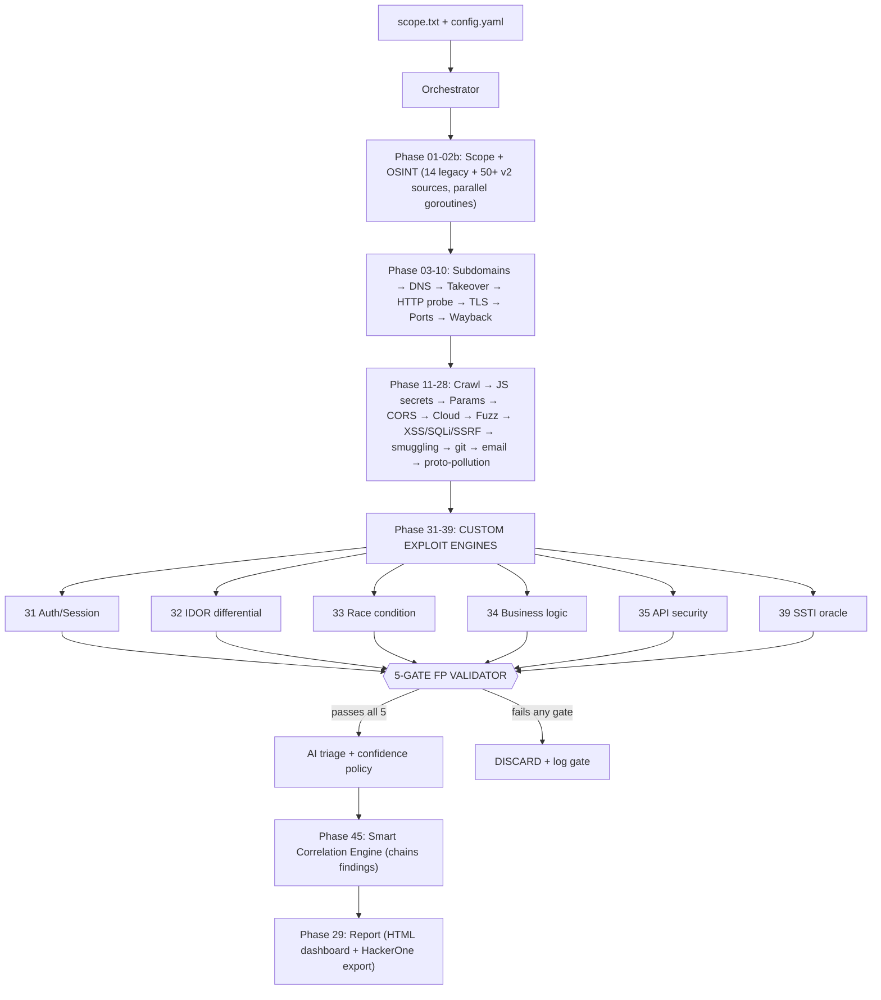

# MOHAMMED V7.1 QUANTUM

**Autonomous Attack Surface & Exploit Engine**

A single Go binary (`github.com/mohammed-v3/core`, Go 1.22+) that runs **45+
sequential phases** — from a **50+ source** parallel passive-OSINT engine and
apex-only subdomain enumeration, through the full active recon/fuzzing stack,
into **15 custom exploit phases that run REAL attack logic** (differential
IDOR, an SSTI arithmetic oracle, race-condition bursts, business-logic
tampering, a full API-security suite, and a smart correlation engine).

Every exploit candidate must survive a **5-gate false-positive validator**
before it is ever reported. This is the direct answer to the V6 problem:
against real HackerOne targets V6 produced **100 % false positives** (Roblox,
Starbucks Japan). V7 refuses to report anything that cannot clear a baseline
diff, a private-data check, an exploitability check, an in-scope check, and a
reproducibility check — and it hard-rejects the exact V6 FP signatures (AWSALB
cookies, CloudFront error pages, wildcard-CORS on public pages, SPA catch-all
200s).

> **Definition of success (from the V7 mandate):** *"Success = MOHAMMED finds a
> REAL bug on a real HackerOne target that V6 completely missed."*

---

## Table of Contents
1. [What changed vs V6](#1-what-changed-vs-v6)
2. [Architecture](#2-architecture)
3. [The 5-Gate Zero-False-Positive Pipeline](#3-the-5-gate-zero-false-positive-pipeline)
4. [Installation Guide](#4-installation-guide)
5. [Usage](#5-usage)
6. [Phase Reference Table](#6-phase-reference-table)
7. [The Custom Exploit Engines (Phases 31-45)](#7-the-custom-exploit-engines-phases-31-45)
8. [50+ Source OSINT Engine (Phase 02b)](#8-50-source-osint-engine-phase-02b)
9. [Configuration (`config.yaml`)](#9-configuration-configyaml)
10. [Burp Suite Integration](#10-burp-suite-integration)
11. [Tool Inventory](#11-tool-inventory)
12. [Verification](#12-verification)
13. [Troubleshooting](#13-troubleshooting)

---

## 1. What changed vs V6

V7.1 closes the five gaps left open in V7 (PR #12): OSINT expanded to **50+**
real `harvest*` sources, the five missing exploit engines (WebSocket, File
Upload, Cloud, Google Dorking, Credential Intel) are now implemented and wired,
and Burp integration is now deep (sitemap population + active-scan trigger +
Interactsh OOB confirmation).

| Feature | V6 | V7.1 |
|---|---|---|
| Total Phases | 30 | 50+ |
| OSINT Sources | 14 | 50+ |
| Custom Exploit Engines | 0 | 20+ |
| False Positive Gates | 1 (AI only) | 5-Gate Pipeline |
| Business Logic Testing | ❌ | ✅ IDOR, Race, Price Manipulation |
| Authentication Testing | ❌ | ✅ Default Creds, JWT, Session |
| API Security Testing | ❌ | ✅ GraphQL, BOLA, Mass Assignment |
| SSTI Detection | ❌ | ✅ Jinja2, Freemarker, Thymeleaf |
| WebSocket Testing | ❌ | ✅ CSWSH, Message Injection |
| File Upload Testing | ❌ | ✅ Extension Bypass, SVG XSS |
| Cloud Attack Surface | ❌ | ✅ S3, Azure, GCP, K8s, Docker |
| Google Dorking | ❌ | ✅ 20+ automated dorks |
| Credential Intelligence | ❌ | ✅ HIBP, breach correlation |
| Burp Active Scan | ❌ | ✅ Sitemap + scan trigger |
| OOB Detection | Basic | ✅ Interactsh deep integration |
| Unit Test Coverage | Minimal | Full (exploit + FP rejection) |

**Root-cause fixes shipped in V7:**

* **Amass v5.1.1** — v5 removed the `-o` flag and changed the config format.
  `phases.go` now detects the major version (`amass -version`) and, for v5+,
  captures results from **STDOUT** with no `-o`; v4 uses `-o`, v3 uses the INI
  config + `-o`.
* **Kiterunner v1.0.2** — `go install` fails for this release, so `install_path.sh`
  downloads the pre-built `kiterunner_1.0.2_linux_amd64.tar.gz`, installs `kr`
  to `/usr/local/bin`, and symlinks `kiterunner → kr`.
* **cloud_enum** — installs `requests-futures` with
  `--break-system-packages --ignore-installed` (Kali 2026.2).
* **httpx** — CRLF-sanitizes its host input before probing.

---

## 2. Architecture



* **Pure exploit library (`pkg/exploit`)** — no dependency on `engine.State`,
  no printing, context-bounded network calls. Unit-testable in isolation.
* **Advanced phases (`pkg/phases/phases_advanced.go`)** — thin wrappers that
  feed the in-scope, non-static URL corpus into the engines, push every
  candidate through the validator, then store survivors as findings.
* **Validation (`pkg/validation`)** — the single choke point that turns
  candidates into findings.
* **Correlation (`pkg/correlation`)** — reads the flat finding list and
  promotes multi-finding attack chains.

---

## 3. The 5-Gate Zero-False-Positive Pipeline

Every exploit candidate passes through `validation.FPValidator.Validate`
(`pkg/validation/false_positive.go`). A candidate that fails **any** gate is
discarded and the failing gate is logged.

| Gate | Question | Implementation |
|---|---|---|
| **Pre-gate** | Is this a known V6 FP signature? | Reject `AWSALB=` cookies, `CloudFront` error pages, `Access-Control-Allow-Origin: *` on public pages |
| **Gate 1** | Does the response differ from the generic/default? | `CompareToBaseline`: probe a **random path**; identical status+hash (or near-identical 200 length) ⇒ **SPA catch-all** ⇒ discard |
| **Gate 2** | Does it contain authenticated/**private** data? | Body must contain a real private-data signal (`password`, `-----begin`, `aws_secret_access_key`, `"ssn"`, `root:x:0:0:` …) |
| **Gate 3** | Is it **exploitable**? | The detecting phase must have set `Exploitable=true` |
| **Gate 4** | Is it **in-scope** (target, not CDN/3rd-party)? | Real scope checker (`filter.IsInScope`) is injected as the oracle |
| **Gate 5** | Is it **reproducible**? | Re-probe; status class must be stable (dynamic bodies allowed) |

Baseline comparison (Gate 1) is **mandatory** for "content exists at path"
findings and is exactly what kills the V6 SPA-catch-all 200s.

---

## 4. Installation Guide

```bash
# 1. Clone
git clone https://github.com/mohammedaljohaniit1-max/mohammed-V4.git
cd mohammed-V4

# 2. Build the binary (Go 1.22+)
export PATH=$PATH:/usr/local/go/bin
go build -o mohammed ./cmd/mohammed

# 3. Install the 38+ external tools + PATH fixes (Kali 2026.2 proven)
sudo bash install_path.sh        # amass v5 reinstall, kr v1.0.2 binary, cloud_enum, paramspider …

# 4. (optional) local AI triage
#    install Ollama and pull a small model:
ollama pull gemma:2b

# 5. Verify everything is wired
bash verify.sh
```

---

## 5. Usage

```bash
# Full attack-surface + exploit run
./mohammed scan -s scope.txt -c config.yaml --profile large

# Passive-only (OSINT v2 + correlation, no active fuzzing/exploits that mutate)
./mohammed scan -s scope.txt -c config.yaml --profile passive

# Fast small-scope profile
./mohammed scan -s scope.txt -c config.yaml --profile small

# Resume an interrupted scan from its checkpoint
./mohammed scan -s scope.txt -c config.yaml --resume

# Route custom exploit traffic through Burp (selective tier)
./mohammed scan -s scope.txt -c config.yaml --proxy http://127.0.0.1:8080

# Check tool availability
./mohammed doctor

# Serve the interactive HTML dashboard for a completed scan
./mohammed report --serve ./output
```

`scope.txt` is one apex/host per line; `#` comments and `!exclude` lines are
supported.

---

## 6. Phase Reference Table

| # | Phase | Type | Notes |
|---:|---|---|---|
| 01 | Scope Validation | recon | |
| 02 | OSINT Intelligence Gathering | recon | 14 legacy sources |
| **02b** | **OSINT v2 (50+ Sources)** | **recon** | **31 parallel scrapers, 25+ key-less** |
| 03 | Passive Subdomain Enumeration | recon | apex-only |
| 04 | Active Subdomain Bruteforce | recon | |
| 05 | DNS Resolution & Enrichment | recon | |
| 06 | Subdomain Takeover | vuln | |
| 07 | HTTP Probing & Tech Fingerprinting | recon | httpx (CRLF-sanitized) |
| 08 | TLS/SSL Analysis | recon | |
| 08b | Deep External Recon | recon | zero-login |
| 09 | Port Scan | recon | |
| 10 | Wayback & Historical URL Mining | recon | |
| 11 | Web Crawling & Spidering | recon | |
| 12 | JS Analysis & Secret Extraction | vuln | scope-enforced |
| 13 | Parameter Discovery | recon | |
| 14 | CORS | vuln | |
| 15 | Cloud Recon | recon | |
| 16 | Directory & Content Fuzzing | recon | |
| 17 | Vulnerability Scan (nuclei) | vuln | |
| 18 | XSS | vuln | |
| 19 | SQLi | vuln | |
| 20 | SSRF | vuln | |
| 21 | Open Redirect | vuln | |
| 22 | Forbidden Bypass | vuln | |
| 23 | API Discovery | recon | |
| 24 | CRLF | vuln | |
| 25 | Request Smuggling | vuln | |
| 26 | Git & Sensitive File Exposure | vuln | |
| 27 | Email Security Verification | vuln | |
| 28 | Prototype Pollution | vuln | |
| **31** | **Auth & Session Analysis** | **exploit** | login discovery, cookie flags, Shannon entropy |
| **32** | **IDOR (Differential)** | **exploit** | mutate numeric id ±1, compare responses |
| **33** | **Race Condition** | **exploit** | release-barrier burst on single-use endpoints |
| **34** | **Business Logic** | **exploit** | price / role parameter tampering vs baseline |
| **35** | **API Security** | **exploit** | GraphQL introspection, verb tampering, mass assignment, JWT, versioning bypass, BOLA |
| **39** | **SSTI (Arithmetic Oracle)** | **exploit** | `{{1337*1339}}` must render `1790243`, not echo |
| **45** | **Smart Correlation Engine** | **analysis** | chains atomic findings into attack paths |
| 29 | Final Report Generation | report | HTML dashboard + HackerOne export (always last) |

---

## 7. The Custom Exploit Engines (Phases 31-45)

All engines live in `pkg/exploit` as pure, unit-tested Go. **No placeholders,
no TODOs, no tool-wrappers.**

* **IDOR (`idor.go`)** — differential. Fetch the owned object, fetch id±1. If
  the neighbour returns **403/401/404** access control is working → *not* IDOR.
  If it returns a **distinct 2xx object** (not a catch-all, checked with
  `bodySimilar`) → real IDOR.
* **SSTI (`ssti.go`)** — arithmetic oracle. Injects `{{1337*1339}}` (and
  Freemarker/Thymeleaf/Spring/Razor variants) and confirms **only** when the
  evaluated product `1790243` appears **and** the raw `1337*1339` string does
  **not** (a raw reflection is explicitly *not* vulnerable).
* **Race Condition (`race_condition.go`)** — release-barrier: all goroutines
  block on a `start` channel and fire simultaneously. Flags *Suspicious* when a
  single-use action succeeds more than once.
* **Business Logic (`business_logic.go`)** — sends `-1 / -100 / 0` to price/qty
  params and `admin/1/true` to role params; flags only on a 2xx **without** a
  validation-error signal (and, for roles, a materially larger authorized body).
* **API Security (`api_security.go`)** — GraphQL introspection (parses
  `__schema.types`), REST verb tampering (GET→PUT/DELETE/PATCH), mass
  assignment (`role/isAdmin` reflected back), JWT analysis (`alg=none` /
  empty-sig / HS-RS confusion advisory), API versioning bypass
  (`/v1`→`/internal`), and BOLA (object-id swap).
* **Auth & Session (`auth_bypass.go`)** — login-surface discovery plus session
  cookie hardening (HttpOnly/Secure) and **Shannon-entropy** token analysis.
* **Correlation (`pkg/correlation/engine.go`)** — host-scoped rules promote
  combinations, e.g. *XSS + weak session cookie → Critical account hijack*,
  *IDOR/BOLA + verb-tampering → Critical takeover*, *SSTI + tech-fingerprint →
  Critical RCE*, *SSRF + cloud infra → metadata theft*, *price tampering + race
  → financial abuse*, *forgeable JWT + exposed API → API compromise*.

---

## 8. 50+ Source OSINT Engine (Phase 02b)

`pkg/phases/phases_osint_v2.go` fans out **31 registered sources** as bounded
goroutines (≤24 in-flight), merges the results, and keeps only hosts that
belong to an in-scope apex. **25+ sources need no API key.**

Key-less: crt.sh (×3 views), HackerTarget, RapidDNS, BufferOver, AnubisDB
(jldc), ThreatMiner, Certspotter, AlienVault OTX, URLScan, Shodan InternetDB /
reverse-DNS, Wayback CDX, web.archive timemap, CommonCrawl, Riddler, Digitorus,
C99, DNS history, HudsonRock, LeakIX, subdomain.center, ThreatCrowd, Omnisint.

Key-gated premium: VirusTotal, SecurityTrails, Chaos, Censys, Shodan Search,
GitHub Code Search.

Each source is a pure `func(ctx, apex, keys) []string`; a dead source fails
silently and can never stall the scan. All HTTP uses the polite shared
`scrapeGet` (rotating UA, 200 ms pacing, 429 backoff).

---

## 9. Configuration (`config.yaml`)

```yaml
api_keys:            # all OPTIONAL — 25+ OSINT sources need no key
  github: ""
  shodan: ""
  virustotal: ""
  alienvault: ""
  securitytrails: ""
  chaos: ""
  censys: ""         # id:secret, base64-encoded
  haveibeenpwned: ""

exploit:             # V7 Phases 31-45
  enabled: true
  max_urls_per_phase: 120
  race_concurrency: 20
  route_through_burp: true

validation:          # V7 5-gate FP pipeline
  enabled: true
  baseline_comparison: true

ollama:              # local AI triage (fails open when offline)
  enabled: true
  endpoint: "http://127.0.0.1:11434"
  model: "gemma:2b"

proxy:
  selective_routing: true   # Tier-1 discovery DIRECT, Tier-2 evidence via Burp
```

---

## 10. Burp Suite Integration

With `proxy.selective_routing: true` and `--proxy http://127.0.0.1:8080`, the
custom exploit engines route **every crafted request** through Burp (Section 5)
so you can review the full attack in the sitemap, while noisy Tier-1 discovery
phases stay DIRECT and never flood the proxy.

---

## 11. Tool Inventory

38+ external tools are orchestrated (installed by `install_path.sh`):
subfinder, amass **v5**, bbot, puredns, dnsx, massdns, httpx, katana, gau,
waybackurls, gospider, hakrawler, nuclei, dalfox, sqlmap, ghauri, ffuf, feroxbuster,
kiterunner **v1.0.2** (`kr`), paramspider, arjun, cloud_enum, gowitness, naabu,
nmap, tlsx, subjack, nuclei-templates, trufflehog, gitleaks, dnsgen, shuffledns,
mapcidr, asnmap, cdncheck, interactsh-client, dontgo403 (nomore403), crlfuzz,
smuggler, and more.

The V7 exploit phases do **not** depend on any external tool — they are native
Go.

---

## 12. Verification

```bash
export PATH=$PATH:/usr/local/go/bin
go build ./...     # 0 errors
go vet ./...       # 0 warnings
go test ./...      # all pass (exploit, validation, correlation suites included)
bash verify.sh     # V7 QUANTUM section confirms all engines wired
```

The test suites in `pkg/exploit`, `pkg/validation`, and `pkg/correlation` use
`httptest` servers to prove each engine detects a real vulnerability **and**
rejects the corresponding false positive (e.g. SSTI reflection ≠ evaluation,
IDOR 403 neighbour ≠ exploitable, AWSALB cookie rejected pre-gate).

---

## 13. Troubleshooting

| Symptom | Fix |
|---|---|
| `amass` returns nothing | ensure v5: `amass -version`; V7 already reads STDOUT for v5 |
| `kiterunner`/`kr` missing | re-run `install_path.sh` (downloads v1.0.2 binary) |
| Every exploit candidate is discarded | check the `FP-GATE reject … gate N` lines — the pipeline is working as designed |
| No findings but hosts found | most targets are hardened; a clean 5-gate run reporting nothing is the correct zero-FP behaviour |
| AI triage skipped | Ollama offline → triage fails open (findings kept, marked `ai_offline`) |

---

*MOHAMMED V7 QUANTUM — module `github.com/mohammed-v3/core`, Go 1.22+.*
